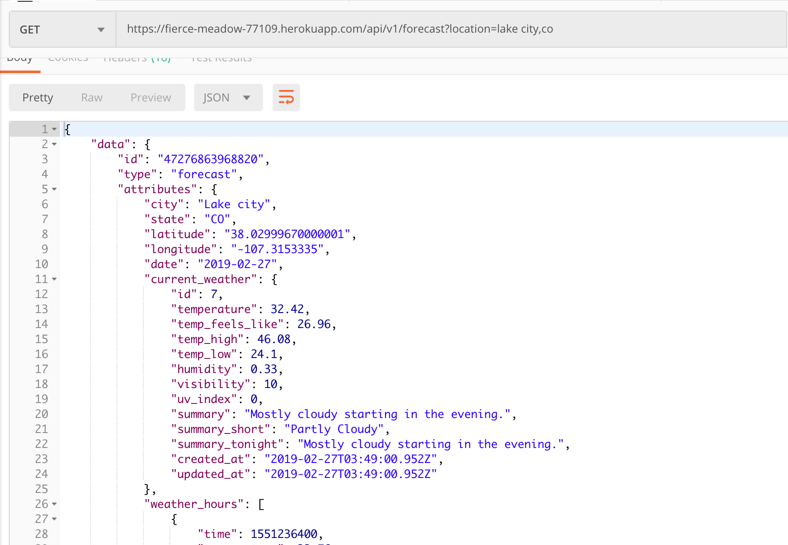

# Sweater Weather

Sweater Weather is a solo project for Module 3 of the [Back-End Engineering Program](https://turing.io/programs/back-end-engineering/) at the [Turing School of Software & Design](https://turing.io/). The project specifications can be found [here](http://backend.turing.io/module3/projects/sweater_weather). In this project, I used Ruby on Rails to consume the [Dark Sky API](https://darksky.net/dev), [Google Geocoding API](https://developers.google.com/maps/documentation/geocoding/start), [Flickr API](https://www.flickr.com/services/api/), and bonus [Giphy API](https://developers.giphy.com/) to build a versioned JSON API for getting weather data for specified locations. The project will function as the back-end of an app, where a user can be created and logged in, and then save favorite locations and get a list of those favorites and the current weather. The project uses [Fast JSON:API](https://github.com/Netflix/fast_jsonapi) and adheres to the [JSON:API](https://jsonapi.org/) specifications.  
You can try out the API in production on [Heroku](https://fierce-meadow-77109.herokuapp.com/)!


## Features
### Forecast
Users can retrieve the forecast for a location using the forecast endpoint: 
```
GET /api/v1/forecast?location=denver,co
```
This will retrieve the location latitude and longitude using the Google Geocoding API, and fetch the weather for that lat/long using the Darksky API.

### Users
Creating a user: 
```
POST /api/v1/users
```
The above endpoint with the appropriate form data in the request body will create a new user and return an API key for that user. 
Use the following endpoint to log a user in: 
```
POST /api/v1/sessions
```

### Favorites
Registered users can create a favorite location by sending an authenticated request containing the location ID to the following endpoint:
```
POST /api/v1/favorites
```
They can retrieve their favorites:
```
GET /api/v1/favorites
```
As well as delete a favorite using the following endpoint and specifying a location ID:
```
DELETE /api/v1/favorites
```

### Caching
In order to speed up the user experience and not continually make calls to the external APIs, locations and weather data are cached in the database. New calls are only made as needed. Weather data is updated using a scheduled job on Heroku.

## Installation
### Local Setup
If you wish to install this app locally, you can fork or clone the repository here. Installation steps once cloned are as follows: 
1. Install the gem packages:
```
$ bundle install
```

2. Set up the database:
```
$ rake db:create
$ rake db:migrate
```

3. Set up Environment Variables:

  You will need to sign up for API keys from: 
  - [Dark Sky API](https://darksky.net/dev) 
  - [Google Geocoding API](https://developers.google.com/maps/documentation/geocoding/start) 
  - [Flickr API](https://www.flickr.com/services/api/) 
  - [Giphy API](https://developers.giphy.com/)

  Run the following command to install `figaro`:
  ```
  figaro install
  ```
  In your newly created `config/application.yml` file, copy and paste the following, and enter your API keys where indicated.

  ```
  google_geocoding_api_key: 
  darksky_api_key: 
  flickr_api_key: 
  giphy_api_key:
  ```

### Running Tests
Once the app is installed locally, you can run the test suite: 
```
$ rspec
```

## Built With: Technologies and Versions
* [Ruby 2.4.5](https://ruby-doc.org/core-2.4.5/)
* [Rails 5.2.2](https://guides.rubyonrails.org/)
* [Fast JSON:API](https://github.com/Netflix/fast_jsonapi)
* [Faraday](https://github.com/lostisland/faraday)
* [Heroku](https://www.heroku.com/)
* [RSpec](http://rspec.info/)
* [Capybara](https://github.com/teamcapybara/capybara/blob/3.12_stable/README.md)
* [vcr](https://github.com/vcr/vcr)

## Author
**[Anna Smolentzov](https://github.com/asmolentzov)**

## Acknowledgements
I would like to thank the wonderful Mod 3 instructors [Mike](https://github.com/mikedao) and [Sal](https://github.com/s-espinosa) for your help with this project and in general at Turing!